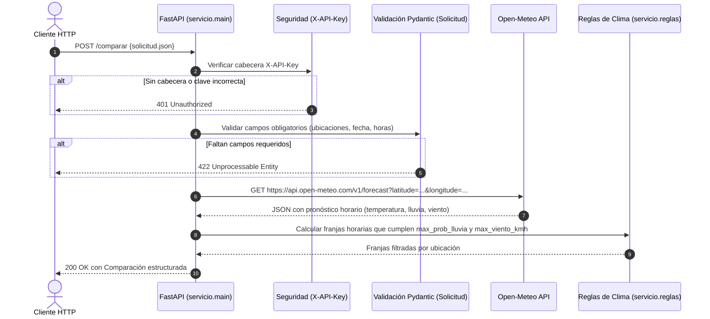

# Explicación de la Secuencia de Integración · LAB-01

**Tema:** Contratos básicos, autenticación y consulta externa  
**Secuencia:** `HTTP ➔ Contrato Pydantic ➔ Open-Meteo ➔ Reglas de Negocio`

---

## Detalle de las 4 Etapas:

1. **Capa HTTP y Seguridad:**
   La solicitud entra al endpoint `/comparar`. Se evalúa la dependencia `verificar_acceso`: si la cabecera `X-API-Key` falta o difiere de `CLAVE_SERVICIO`, se aborta inmediatamente con un código `401 Unauthorized`.

2. **Capa de Contrato (Pydantic):**
   El cuerpo de la petición se valida contra el modelo `Solicitud`. Se verifica que las coordenadas de latitud/longitud existan y que la fecha y duración sean válidas. Si faltan datos, se devuelve `422 Unprocessable Entity` antes de consumir red.

3. **Capa de Integración Externa (Open-Meteo):**
   Con los datos validados, el servicio lanza consultas HTTP asíncronas hacia la API pública de Open-Meteo para cada una de las coordenadas especificadas (`Cusco`, `Arequipa`). Se obtienen las 24 horas del día solicitado con sus probabilidades de precipitación y velocidades de viento.

4. **Capa de Reglas de Negocio:**
   El código en `servicio/reglas.py` recorre las ventanas de tiempo continuas de tamaño `duracion_horas` (ej. 4 horas entre las 09:00 y las 18:00) y descarta aquellas que excedan los umbrales de lluvia o viento máximos, devolviendo únicamente las opciones viables y seguras.
