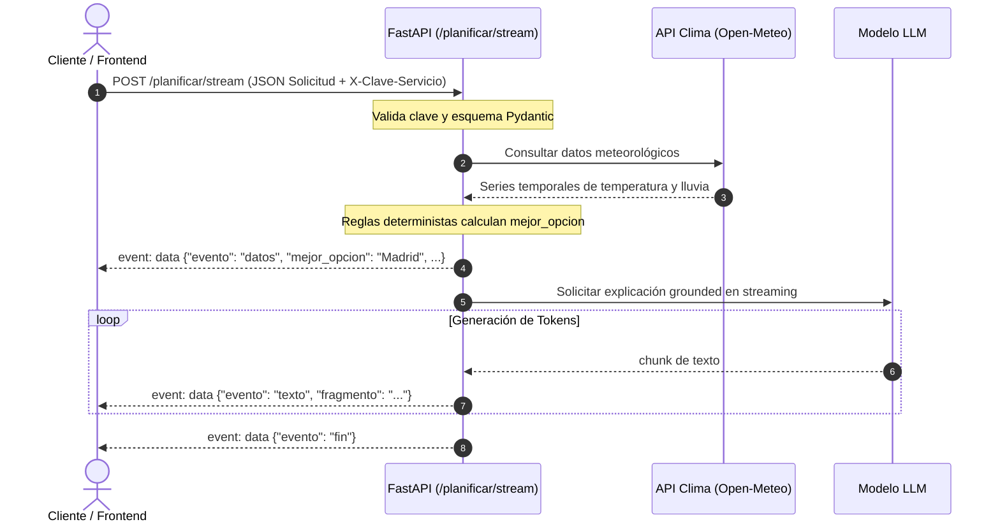

# LAB-02: Secuencia de Eventos SSE (`/planificar/stream`)

## Descripción del Endpoint

El endpoint `POST /planificar/stream` utiliza Server-Sent Events (`text/event-stream`) para transmitir progresivamente el resultado de la planificación del viaje al cliente, mejorando notablemente la percepción de latencia y evitando timeouts en conexiones lentas.

- **Encabezados HTTP:**
  - `Content-Type: text/event-stream`
  - `Cache-Control: no-cache`
  - `X-Accel-Buffering: no`
- **Protocolo de Eventos:**
  1. `datos`: Payload estructurado inicial con los resultados deterministas calculados por el servicio (pronóstico de clima y comparación de opciones recomendadas).
  2. `texto`: Fragmentos incrementales (*tokens*) generados por el LLM a medida que formula la explicación para el usuario.
  3. `fin`: Señalización explícita de término exitoso del flujo de eventos.
  4. `error`: Si ocurre una excepción controlada tras iniciar el streaming, se emite un evento `error` y nunca `fin`.

---

## Captura de la Secuencia de Eventos (Raw SSE)

```sse
data: {"evento": "datos", "mejor_opcion": "Madrid", "opciones": [{"destino": "Madrid", "temperatura_maxima_c": 22.4, "precipitacion_mm": 0.0, "puntuacion": 9.2}, {"destino": "Barcelona", "temperatura_maxima_c": 19.8, "precipitacion_mm": 2.1, "puntuacion": 7.5}], "advertencias": []}

data: {"evento": "texto", "fragmento": "Recomendamos"}

data: {"evento": "texto", "fragmento": " viajar a"}

data: {"evento": "texto", "fragmento": " Madrid."}

data: {"evento": "texto", "fragmento": " La temperatura"}

data: {"evento": "texto", "fragmento": " máxima estimada"}

data: {"evento": "texto", "fragmento": " es de 22.4°C"}

data: {"evento": "texto", "fragmento": " sin precipitaciones,"}

data: {"evento": "texto", "fragmento": " mientras que en"}

data: {"evento": "texto", "fragmento": " Barcelona hay"}

data: {"evento": "texto", "fragmento": " probabilidad de"}

data: {"evento": "texto", "fragmento": " lluvia (2.1 mm)."}

data: {"evento": "texto", "fragmento": " ¡Disfrute su viaje!"}

data: {"evento": "fin"}
```

---

## Diagrama de Secuencia


